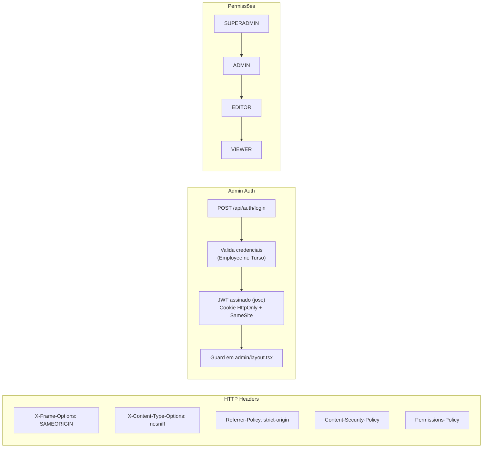

# 🔒 Segurança — solucoesrkm.com

Documentação completa das camadas de segurança implementadas na landing page corporativa.

> **Quando consultar**: Ao adicionar endpoints, modificar autenticação ou auditar proteções.

---

## 1. Visão Geral



---

## 2. HTTP Security Headers

Configurados em `next.config.ts` para **todas as rotas** (`source: '/(.*)'`):

| Header | Valor | Proteção |
|--------|-------|----------|
| `X-Frame-Options` | `SAMEORIGIN` | Previne clickjacking (iframe de terceiros) |
| `X-Content-Type-Options` | `nosniff` | Previne MIME type sniffing |
| `Referrer-Policy` | `strict-origin-when-cross-origin` | Limita informações enviadas ao referrer |
| `Permissions-Policy` | `camera=(), microphone=(), geolocation=()` | Desativa APIs sensíveis do browser |
| `Content-Security-Policy` | Ver abaixo | Whitelist de origens permitidas |

### Content Security Policy (CSP)

```
default-src 'self'
script-src  'self' 'unsafe-inline' 'unsafe-eval'
            https://*.freshworks.com https://*.freshdesk.com
            https://www.googletagmanager.com
style-src   'self' 'unsafe-inline' https://fonts.googleapis.com
font-src    'self' https://fonts.gstatic.com
img-src     'self' data: blob:
            https://www.googletagmanager.com https://www.google-analytics.com
connect-src 'self'
            https://*.freshworks.com https://*.freshdesk.com
            https://www.googletagmanager.com https://analytics.google.com
            https://economia.awesomeapi.com.br
frame-src   'self' https://*.freshworks.com https://www.googletagmanager.com
worker-src  'self' blob:
object-src  'none'
base-uri    'self'
form-action 'self'
```

> ⚠️ **Regra**: nunca remover ou enfraquecer o CSP. Se precisar adicionar uma nova origem (ex: analytics, CDN), adicione à whitelist no `next.config.ts` — não use `*` como wildcard.

---

## 3. Autenticação Admin

### Credenciais

O admin usa a tabela `Employee` no banco Turso local da landing.  
**Não há cadastro público** — usuários são criados via seed script ou manualmente.

### Fluxo de Login

```
POST /api/auth/login
  → valida body (email + password)
  → busca User por email → verifica Employee
  → bcrypt.compare(password, passwordHash)
  → gera JWT (jose) com { userId, email, role, employeeRole }
  → seta cookie 'session' (HttpOnly, Secure, SameSite=Lax)
  → redirect /admin/settings
```

### Fluxo de Logout

```
POST /api/auth/logout
  → limpa cookie 'session' (maxAge=0)
  → redirect /admin/login
```

### Guard de rota

Todo acesso a `/admin/*` passa pelo guard em `src/app/[locale]/admin/layout.tsx`:

```typescript
const session = await getSession();
if (!session) redirect(`/${locale}/admin/login`);
```

### JWT

- **Biblioteca**: `jose` (Web Crypto API — compatível com Edge Runtime)
- **Algoritmo**: HS256
- **Payload**: `{ userId, email, name, role, employeeRole, iat, exp }`
- **Expiração**: 8 horas
- **Cookie**: `HttpOnly; Secure; SameSite=Lax; Path=/`

> ⚠️ `JWT_SECRET` com menos de 32 caracteres lança erro no boot em produção. Gere com: `openssl rand -base64 32`

---

## 4. Controle de Acesso

| Role (`Employee.role`) | Pode ver admin | Pode editar settings | Pode gerenciar usuários |
|------------------------|---------------|---------------------|------------------------|
| `SUPERADMIN` | ✅ | ✅ | ✅ |
| `ADMIN` | ✅ | ✅ | ❌ |
| `EDITOR` | ✅ | ✅ | ❌ |
| `VIEWER` | ✅ | ❌ | ❌ |

Verificação via `canEdit(role)` e `canView(role)` de `@/lib/auth`:

```typescript
import { getSession, canEdit, getSystemRole } from '@/lib/auth';

const session = await getSession();
const role = await getSystemRole(session.userId);
if (!canEdit(role)) return { error: 'Sem permissão' };
```

> ⚠️ **Invariante**: toda Server Action de escrita DEVE chamar `canEdit()` — não confie apenas no guard do layout.

---

## 5. Proteção de API Keys

API keys externas (Google Places, etc.) armazenadas no `SiteSettings` são **mascaradas no diff**:

```typescript
// No histórico, API keys aparecem assim:
{ googlePlacesApiKey: "AIza****...****Xyz" }  // ← nunca o valor real
```

Implementado em `computeApiKeysDiff()` em `site-settings.actions.ts`.

---

## 6. Proteção de Rotas do Cron

O endpoint `/api/cron/freshdesk-sync` valida o header `Authorization`:

```
Authorization: Bearer {CRON_SECRET}
```

Sem esse header (ou com valor errado), retorna `401`. A Vercel passa esse secret automaticamente em chamadas de Cron.

---

## 7. CSRF

Rotas de mutação (POST admin) confiam em `SameSite=Lax` do cookie de sessão para proteção básica.  
A landing não processa dados de usuários externos — apenas admins autenticados fazem mutations.

---

## 8. Proteção Server-Only

Funções que usam Prisma internamente **não têm `'use server'`** e são exclusivas de Server Components:

```typescript
// ✅ Server Component (page.tsx)
const config = await getSiteSettings('landing_page_config');

// ✅ Client Component via Server Action
const result = await updateSiteSettings('landing_page_config', data);

// ❌ PERIGOSO — expõe Prisma ao bundle do browser
useEffect(() => { getSiteSettings('...').then(...) }, []);
```

> Toda leitura necessária em Client Components deve ter um `*Action` correspondente em `site-settings.actions.ts`.

---

## 9. Auditoria e Histórico

Toda mutação via `updateSiteSettings()` registra automaticamente:
- Timestamp
- Usuário (`session.email`)
- Diff computado (apenas campos alterados, com API keys mascaradas)
- Histórico rotativo (mantém `MAX_HISTORY_ENTRIES` entradas — FIFO)

```typescript
// Chave de histórico gerada automaticamente:
'landing_page_config'  →  'landing_page_config_history'
'freshdesk_config'     →  'freshdesk_config_history'
```

---

## 10. Checklist de Segurança — ao adicionar novo endpoint

```
[ ] Autenticação: getSession() verificado
[ ] Autorização: canEdit(role) ou canView(role) verificado
[ ] Sem Prisma direto em Client Components
[ ] API keys não expostas em responses ao cliente
[ ] Novo endpoint externo adicionado ao CSP no next.config.ts
[ ] Header Authorization validado se for endpoint de cron/integração
```
