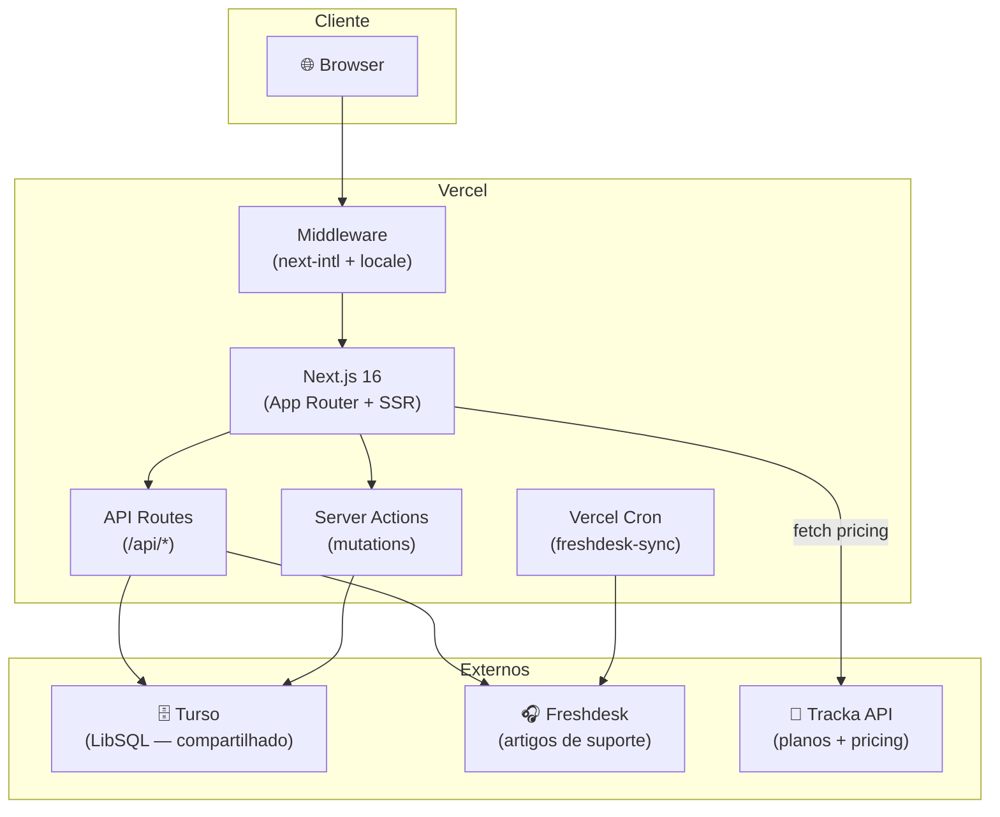
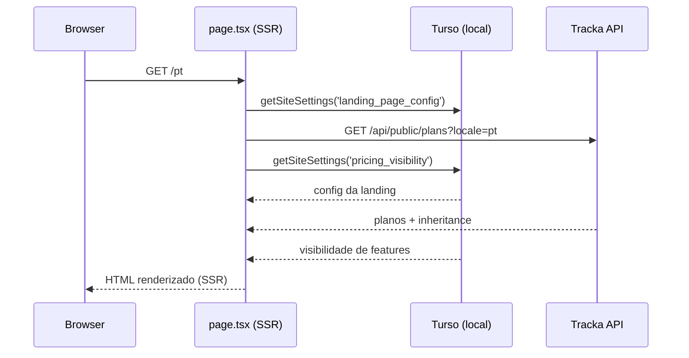
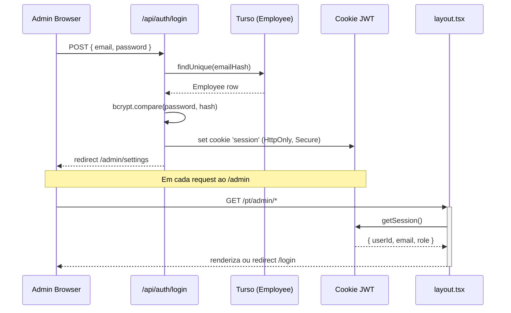
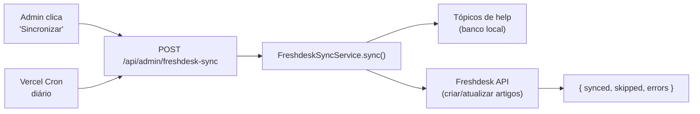

# 🏗️ Arquitetura — solucoesrkm.com

Visão técnica completa da landing page corporativa da plataforma Tracka.

> **Público**: Desenvolvedores e agentes de IA.  
> **Quando consultar**: Ao projetar novas seções, entender o fluxo de dados ou fazer onboarding.

---

## 1. Infraestrutura



---

## 2. Domínios e Locales

```
solucoesrkm.com/pt → Landing PT
solucoesrkm.com/en → Landing EN
solucoesrkm.com/pt/admin → Admin (Employee apenas)
localhost:3001/pt  → Desenvolvimento local
```

Middleware (`src/middleware.ts`) redireciona `/` para `/pt` e gerencia locale prefix via `next-intl`.

---

## 3. Fluxo de Dados — Landing Page



**Cache**: A chamada ao Tracka usa `next: { revalidate: 60 }` — os planos são atualizados a cada 60s sem redeploy.

---

## 4. Padrão SiteSettings

Toda configuração do site é armazenada em pares `key → JSON` na tabela `SiteSettings`:

```
SiteSettings
┌────────────────────────────┬──────────────────────────────────┐
│ key                        │ value (JSON)                     │
├────────────────────────────┼──────────────────────────────────┤
│ landing_page_config        │ { heroTitle, faq[], ... }        │
│ landing_page_config_pt     │ override PT                      │
│ landing_page_config_en     │ override EN                      │
│ landing_page_config_history│ [ { timestamp, changes[] } ]    │
│ freshdesk_config           │ { apiKey, domain, widgetId }     │
│ freshdesk_config_history   │ [ { timestamp, changes[] } ]    │
│ api_keys                   │ { googlePlacesApiKey }           │
│ api_keys_history           │ [ { timestamp, changes[] } ]    │
│ pricing_visibility         │ { free: [], plus: [], pro: [] }  │
└────────────────────────────┴──────────────────────────────────┘
```

### CRUD centralizado

```typescript
// src/application/admin/site-settings.actions.ts

getSiteSettings(key)        // leitura pública (sem auth)
updateSiteSettings(key, v)  // escrita protegida (Employee ADMIN/EDITOR)
getSettingsHistory(histKey)  // leitura do histórico
```

Diff automático: toda escrita calcula as mudanças e salva em `key_history`.

---

## 5. Autenticação Admin



**JWT payload**: `{ userId, email, name, role, iat, exp }`  
**Validade**: 7 dias (renovado a cada login)

---

## 6. Herança de Planos (v0.7.3)

A landing **não calcula** a herança — ela apenas recebe e renderiza:

```
Tracka API /api/public/plans?locale=pt
  └── detectPlanInheritance() [calculado no Tracka]
       └── retorna { inheritsFrom, inheritsFromName, exclusiveFeatures }

PricingSection.tsx
  ├── plan.inheritance existe? → mostra separador "Tudo do Plus, mais:" + exclusiveFeatures
  └── plan.inheritance ausente/null? → mostra features[] completa (fallback)
```

**Retrocompatibilidade**: se a API não retornar `inheritance` (versão antiga do Tracka), o componente exibe lista completa sem erros.

---

## 7. Sync com Freshdesk



**Autenticação do Cron**: header `Authorization: Bearer CRON_SECRET`

---

## 8. Hierarquia de Permissões

```
SUPERADMIN → tudo
ADMIN      → editar configs + help + freshdesk
EDITOR     → editar configs básicos (sem API keys)
VIEWER     → somente leitura do painel
```

Funções: `canEdit(role)`, `canView(role)` de `@/domain/auth/auth`.

---

## 9. Estrutura i18n

```
messages/
├── pt.json     # Português — fonte primária
└── en.json     # Inglês

Namespaces usados:
  landing.*     → textos da landing page
  admin.*       → textos do painel admin
  help.*        → central de ajuda
  common.*      → reutilizáveis (botões, erros, datas)
  legal.*       → termos, privacidade, cookies
```

**Regra crítica**: ao adicionar qualquer string nova, adicionar em **ambos** os arquivos antes de commitar.

---

## 10. Mapa de Referências

| Para entender... | Consulte |
|-----------------|----------|
| Setup e stack | [README.md](../README.md) |
| Padrões de código e AI quickstart | [CONTRIBUTING.md](../CONTRIBUTING.md) |
| Painel admin (seção por seção) | [docs/AdminGuide.md](AdminGuide.md) |
| Histórico de versões | [CHANGELOG.md](../CHANGELOG.md) |
| Variáveis de ambiente | [.env.example](../.env.example) |
