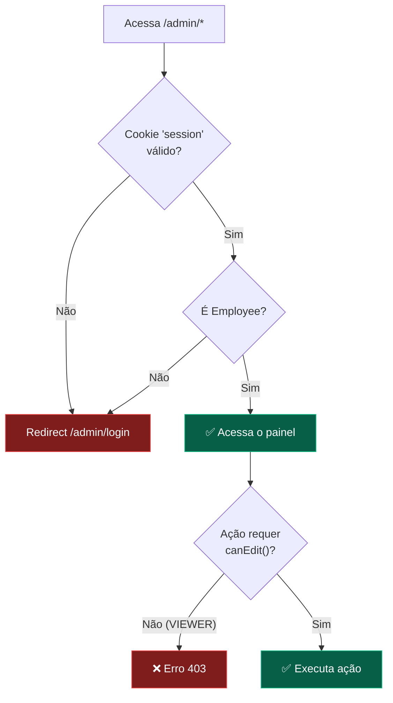

# 👥 Papéis e Permissões — solucoesrkm.com

Documentação completa do sistema de papéis do painel admin da landing page.

---

## 1. Visão Geral

O admin da landing usa dois modelos de role:

```
User.role        → "SUPERADMIN" | "EMPLOYEE"  (acesso ao sistema)
Employee.role    → "ADMIN" | "EDITOR" | "VIEWER"  (permissões no admin)
```

Um funcionário precisa de **ambos**: ser `User` E ter um registro `Employee`.

---

## 2. Matriz de Permissões

| Ação | SUPERADMIN | ADMIN | EDITOR | VIEWER |
|------|:---:|:---:|:---:|:---:|
| **Ver painel admin** | ✅ | ✅ | ✅ | ✅ |
| **Ver histórico de alterações** | ✅ | ✅ | ✅ | ✅ |
| **Validar help (read-only)** | ✅ | ✅ | ✅ | ✅ |
| **Editar landing page config** | ✅ | ✅ | ✅ | ❌ |
| **Editar features/pricing** | ✅ | ✅ | ✅ | ❌ |
| **Editar Freshdesk config** | ✅ | ✅ | ✅ | ❌ |
| **Sincronizar Freshdesk** | ✅ | ✅ | ✅ | ❌ |
| **Editar/criar help topics** | ✅ | ✅ | ✅ | ❌ |
| **Traduzir campos** | ✅ | ✅ | ✅ | ❌ |
| **Gerenciar API Keys** | ✅ | ✅ | ❌ | ❌ |
| **Config de tradução** | ✅ | ✅ | ❌ | ❌ |
| **Gerenciar usuários admin** | ✅ | ❌ | ❌ | ❌ |

---

## 3. Descrição de Cada Role

### `SUPERADMIN`

- Acesso irrestrito a todo o sistema
- Único que pode criar/remover outros funcionários admin
- Implica `Employee.role = "ADMIN"` automaticamente

### `ADMIN`

- Gerencia toda a landing page sem restrições
- Pode gerenciar API keys e configurar integrações
- **Não pode** criar/remover outros funcionários

### `EDITOR`

- Role padrão para funcionários de conteúdo
- Pode editar textos, features, FAQ, depoimentos, pricing
- **Não pode** acessar API keys ou configurar tradução automática

### `VIEWER`

- Acesso read-only ao painel
- Pode ver configurações, histórico e validar help
- Útil para stakeholders não-técnicos ou auditores

---

## 4. Implementação

### Verificação de permissão

```typescript
import { getSession, getSystemRole, canEdit, canView } from '@/lib/auth';

const session = await getSession();
if (!session) redirect('/admin/login');

const role = await getSystemRole(session.userId);

if (!canEdit(role)) {
    return { error: 'Sem permissão de edição' };
}
```

### Funções disponíveis

| Função | Retorno | Quem passa |
|--------|---------|------------|
| `getSession()` | `SessionPayload \| null` | Qualquer requisição com cookie válido |
| `getSystemRole(userId)` | `string \| null` | Employee.role do usuário |
| `canEdit(role)` | `boolean` | ADMIN, EDITOR, SUPERADMIN |
| `canView(role)` | `boolean` | Todos os Employees |

---

## 5. Criando um Novo Funcionário Admin

Não existe interface UI para criar funcionários — é feito via script:

```typescript
// scripts/create-admin.mjs
import { PrismaClient } from '@prisma/client';
import bcrypt from 'bcryptjs';

const prisma = new PrismaClient();

await prisma.user.create({
    data: {
        email: 'novo@solucoesrkm.com',
        name: 'Novo Funcionário',
        passwordHash: await bcrypt.hash('SenhaForte123!', 12),
        role: 'EMPLOYEE',
        employee: {
            create: { role: 'EDITOR' }, // ADMIN | EDITOR | VIEWER
        },
    },
});

await prisma.$disconnect();
```

```bash
node scripts/create-admin.mjs
```

---

## 6. Fluxo de Autenticação



---

## 7. Senhas

- **Hash**: `bcrypt` com `cost factor 12`
- **Sem reset de senha via UI**: reset é feito via script (rodar `bcrypt.hash()` + `prisma.user.update()`)
- **Sem OAuth**: login apenas por email + senha
- **Sem 2FA** (na versão atual): ver [CONCEPTS.md](../CONCEPTS.md#10-por-que-o-admin-da-landing-não-tem-2fa) para a decisão

---

## 8. Invariantes

| Regra | Consequência se quebrada |
|-------|--------------------------|
| Verificar `canEdit(role)` em toda Server Action de escrita | Viewer pode modificar conteúdo |
| Verificar `getSession()` antes de qualquer dado admin | Dados admin expostos sem auth |
| Nunca criar `User` sem `Employee` para acesso admin | Login funciona mas redirect para login novamente |
| Nunca retornar API keys em plaintext | Vazamento de credenciais externas |
